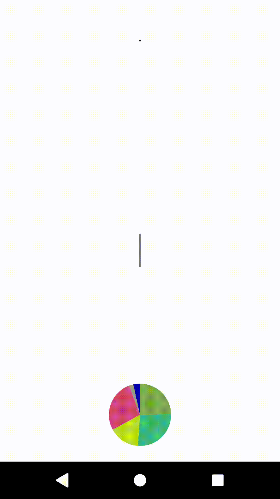

# ChartView
Android View for displaying charts. PieChartView can be adjusted by using custom XML attributes. These attributes include border size and color, donut size and reveal animation settings.
### Usage
Declaring view in layout:
```xml
    <tw0reck1.chartview.PieChartView
        android:id="@+id/piechart"
        android:layout_width="match_parent"
        android:layout_height="match_parent"
        android:padding="4dp"
        app:pcv_border_width="2dp"
        app:pcv_donut_ratio="0.75"
        app:pcv_animation_type="one_by_one"/>

```
Setup code:
```kotlin
...
    override fun onCreate(savedInstanceState: Bundle?) {
        super.onCreate(savedInstanceState)
        setContentView(R.layout.activity_main)

        val pieChartView = findViewById(R.id.piechart)
        pieChartView.showChart(data, colors, AnimationType.ONE_BY_ONE, 1500)
    }
...
```
### Pie chart samples

